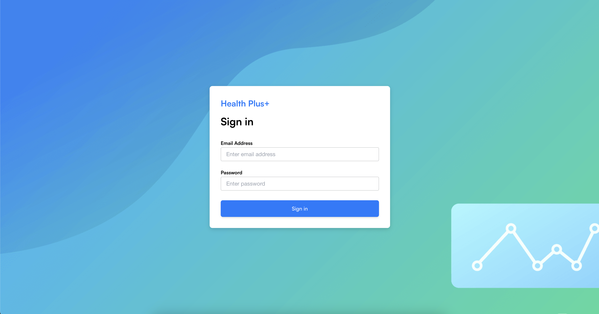
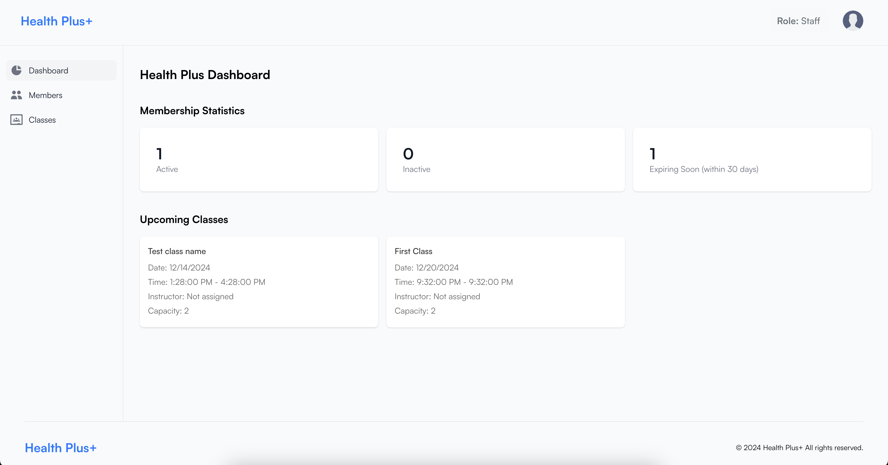
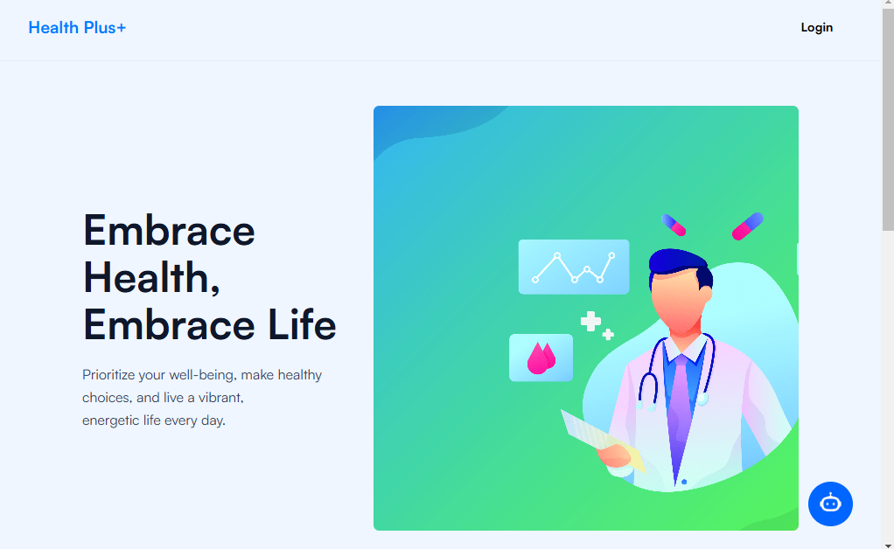
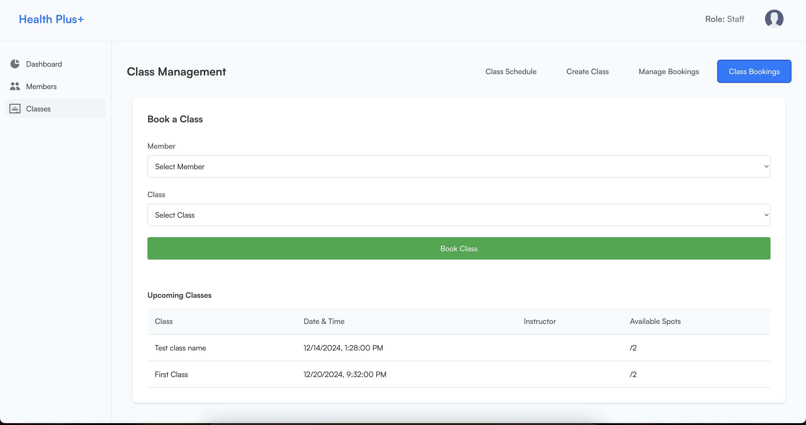
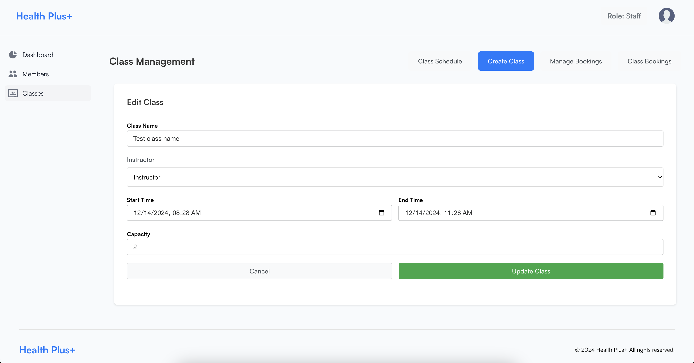
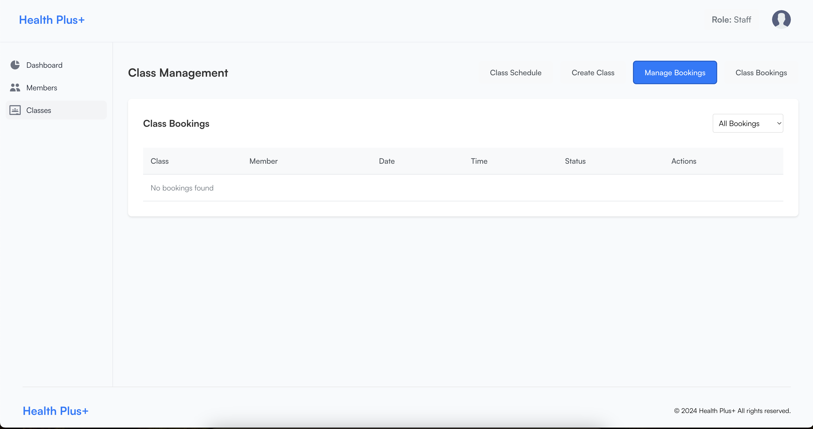
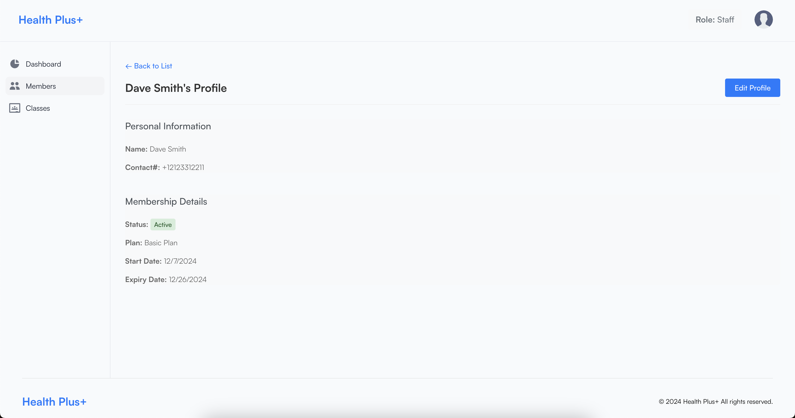
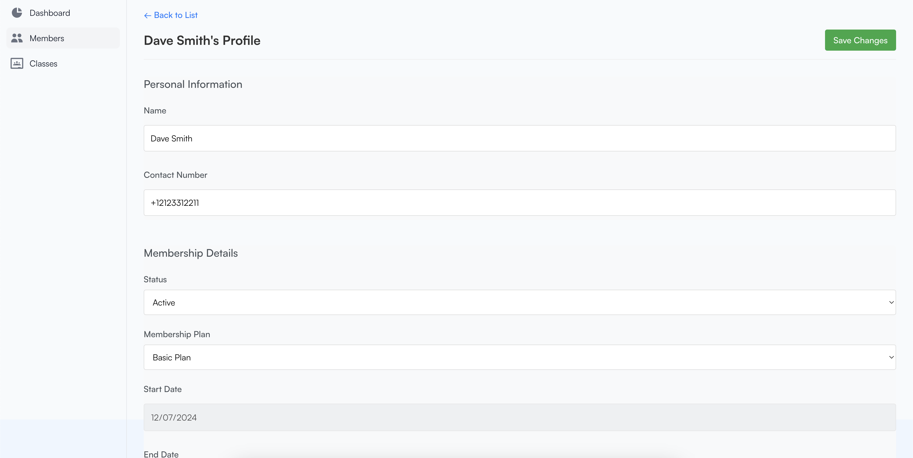
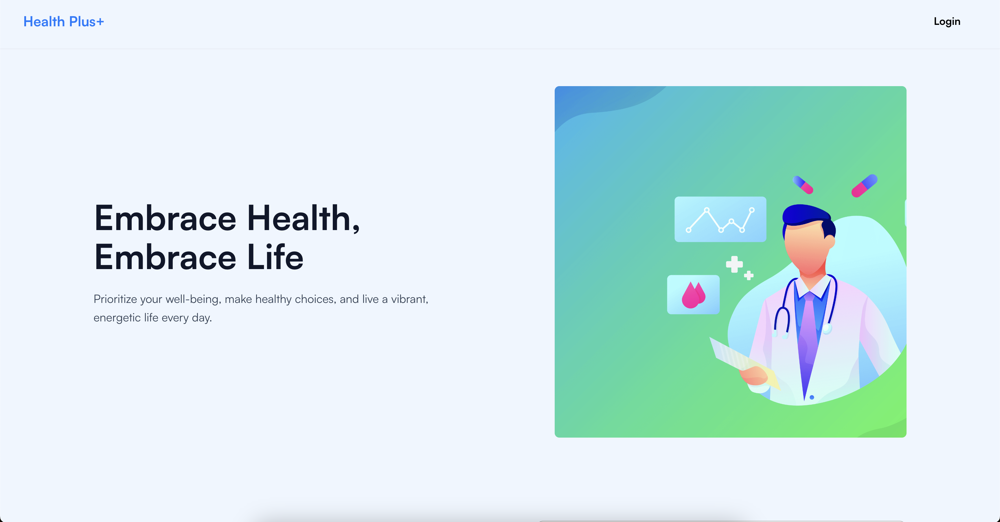

# HealthPlus - User Documentation

## 1. Introduction
Welcome to the **HealthPlus Fitness Management System**! This platform is designed to streamline fitness center operations and provide an exceptional user experience. With HealthPlus, you can:

- Manage memberships and member details.
- Book and schedule fitness classes.
- Track customer progress with analytics.
- Use a ChatBot for instant assistance.

---

## 2. Getting Started

### System Compatibility
- Browser: Google Chrome (recommended), Mozilla Firefox, Microsoft Edge.
- Devices: Desktop, tablet, or mobile.

### Access Instructions
1. Open the HealthPlus application in your browser: **[App URL]**.
2. Enter your username and password on the login page.
   
3. Click **Log In** to access your dashboard.
   

---

## 3. Features Guide

### **3.1 ChatBot**
1. Click on the ChatBot icon in the bottom-right corner.
2. Type your query, e.g., "What classes are available today?"
   

3. Example interactions:
   - **"Show my bookings"**: The ChatBot will display all active class bookings.
   - **"Help with creating a class"**: Redirects you to the class creation page.
   - **"What’s my next class?"**: Displays the next scheduled class with time and instructor details.

---

### **3.2 Class Management**
#### Creating a Class
1. Navigate to the **Classes** tab.
2. Click **Create Class** and fill in details.
   - Enter the class name, date, time, and capacity.
   - Assign a trainer from the dropdown menu.
   

#### Editing a Class
1. Select a class and click **Edit**.
2. Update details like time or capacity.
3. Save changes by clicking the **Update Class** button.
   

#### Booking a Class
1. Members can view available classes in the **Classes** section.
2. Click on a class to view its details and then click **Book Now**.
   

---

### **3.3 Member Profiles**
#### Viewing Member Details
1. Go to the **Members** section.
2. Click a member to view their profile.
   

#### Editing Member Profiles
1. Select a member and click **Edit Profile**.
2. Update contact details or membership status.
   

---

### **3.4 Dashboard Features**
1. **Analytics Overview**:
   - View key metrics like total members, active classes, and revenue stats.
   - Use filters to analyze specific date ranges or trainers.
   - Example:
     

2. **Quick Actions**:
   - Access shortcuts to common features like creating classes or viewing bookings.

---

### 3.5 Understanding How Your Data is Organized

HealthPlus organizes your information into interconnected categories to make it easy to manage and access. Here's a simplified overview:

*   **Your Profile (Users):** This contains your personal information, login details, and your role (e.g., member, instructor, admin).
*   **Membership Plans:** These define the different types of memberships available, including pricing, duration, and included features.
*   **Your Membership (Members):** This links you to a specific membership plan and tracks your membership status, start and end dates.
*   **Classes:** These are the fitness classes offered, including the instructor, date, time, and capacity.
*   **Bookings:** These are your reservations for specific classes. They link your membership to a class.

---
This structure ensures that all your information is organized and readily accessible within the HealthPlus system.

## 4. FAQs and Troubleshooting

### FAQs
#### **How do I use the ChatBot?**
Click the ChatBot icon and type your query, e.g., "Show my bookings."

#### **Why can’t I book a class?**
- Ensure the class isn't full.
- Check if prerequisites for the class are met.
- Confirm your membership is active.

#### **How do I reset my password?**
1. Click the **Forgot Password** link on the login page.
2. Enter your registered email address and follow the reset instructions.

---

### Troubleshooting
#### **Login Issues**
- Double-check your username and password.
- Clear your browser cache and cookies if issues persist.

#### **ChatBot Isn’t Responding**
- Refresh the page or log out and log back in.
- Check your internet connection.

#### **Page Not Loading Properly**
- Ensure your browser is up to date.
- Try accessing the platform in an incognito window.

---

## 5. Support and Feedback
For assistance, please reach out via:

- **Email**: support@healthplus.com
- **Phone**: +1 (123) 456-7890
- **Feedback Form**: Available on the dashboard under the "Help" section.

---

We hope you enjoy using HealthPlus! If you encounter any issues or have suggestions, don't hesitate to contact our support team.