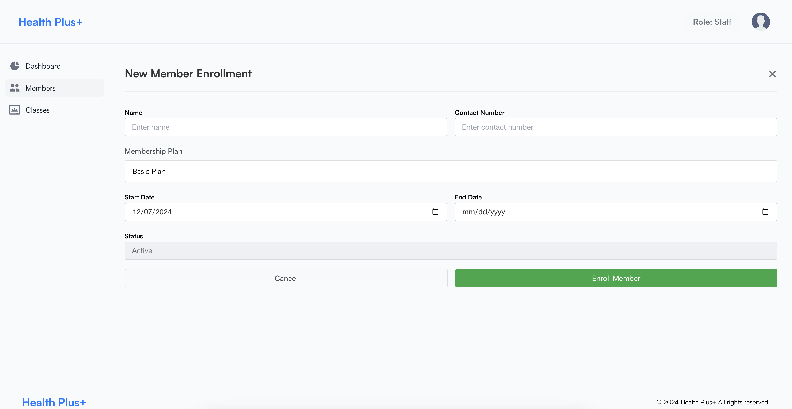
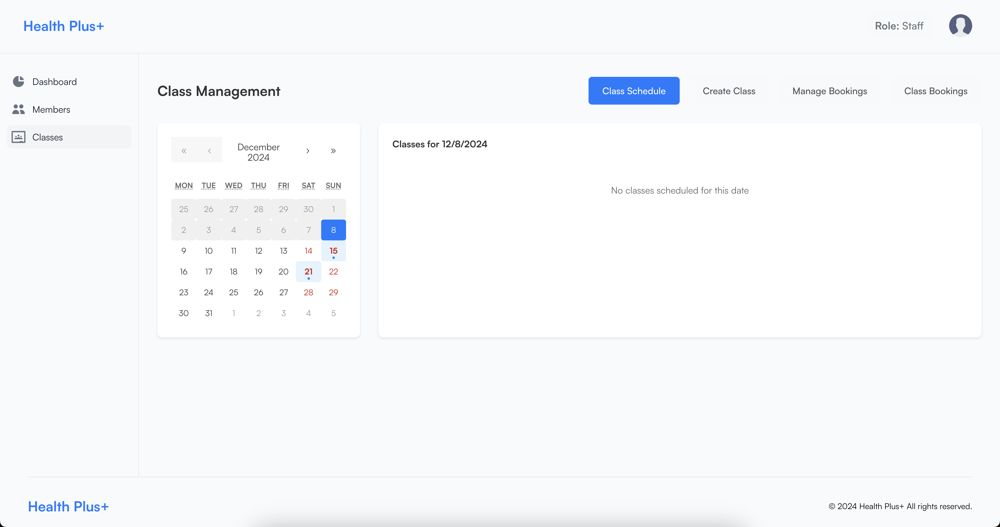
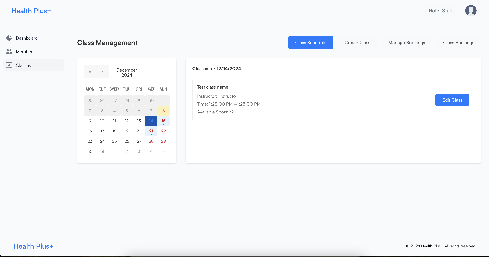

# HealthPlus - User Documentation

## 1. Introduction
Welcome to the **HealthPlus Fitness Management System**! This platform is designed to streamline fitness center operations and provide an exceptional user experience. With HealthPlus, you can:

- Manage memberships and member details.
- Book and schedule fitness classes.
- Track customer progress with analytics.
- View and manage activities through an interactive dashboard.

This guide is tailored for **Admins**, **Trainers**, and **Members**, highlighting their specific functionalities.

---

## 2. Getting Started

### System Compatibility
- Browser: Google Chrome (recommended), Mozilla Firefox, Microsoft Edge.
- Devices: Desktop, tablet, or mobile with responsive support.

### Access Instructions
1. Open the HealthPlus application in your browser: **[App URL]**.
2. Enter your username and password on the login page.
   
3. Click **Log In** to access your dashboard.
4. The dashboard will provide an overview of activities and navigation options:
   

---

## 3. Features Guide

### **3.1 Admin Features**
#### Managing Members
1. Navigate to the **Members** tab.
2. View a list of members with details.
3. Add a new member by clicking **Add Member** and filling out the form.
   
4. Edit or delete members as needed.

#### Viewing Analytics
1. Open the **Analytics** tab.
2. Filter data by date range or class type.
3. Download reports for revenue and attendance.

#### Scheduling Classes
1. Navigate to the **Classes** section.
2. Add a new class with details like time, capacity, and trainer assignment.
   
3. Update or cancel classes as needed.

---

### **3.2 Trainer Features**
#### Monitoring Schedules
1. Open the **Schedule** tab.
2. View upcoming classes and attendance lists.
   

#### Managing Classes
1. Edit class details such as timings or locations.
2. Mark attendance for each class.

---

### **3.3 Member Features**
#### Booking Classes
1. Navigate to the **Classes** section using the navigation menu.
2. Select a class from the list and click **Book Now**.
   
3. Confirm your booking.

#### Viewing Progress
1. Open the **My Progress** section.
2. Track your attendance and activity history.
   

---

## 4. FAQs and Troubleshooting

### FAQs
#### **I forgot my password.**
1. Click the **Forgot Password** link on the login page.
2. Enter your email address and follow the reset instructions.

#### **Why can’t I book a class?**
- Ensure the class is available and not fully booked.
- Check that you meet the prerequisites for the class.

#### **How do I report an issue?**
- Use the **Feedback Form** in the **Help** section or contact support.

---

### Troubleshooting
#### **Login Issues**
- Double-check your credentials.
- Clear your browser’s cache and cookies.

#### **Page Not Loading**
- Ensure your internet connection is stable.
- Update your browser to the latest version.

---

## 5. Support and Feedback
For assistance, please reach out via:

- **Email**: support@healthplus.com
- **Phone**: +1 (123) 456-7890
- **Working Hours**: Monday to Friday, 9 AM to 6 PM EST.
- **Feedback Form**: Available on the dashboard under the "Help" section.

---

We hope you enjoy using HealthPlus!